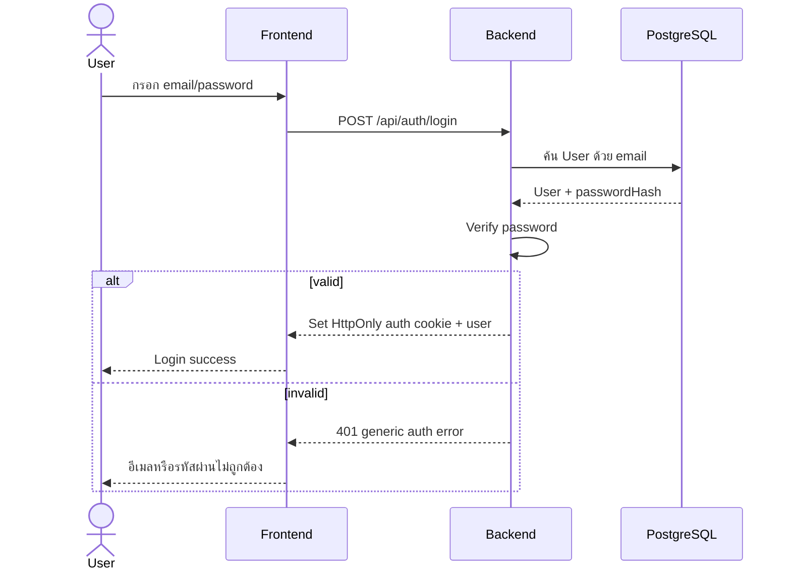
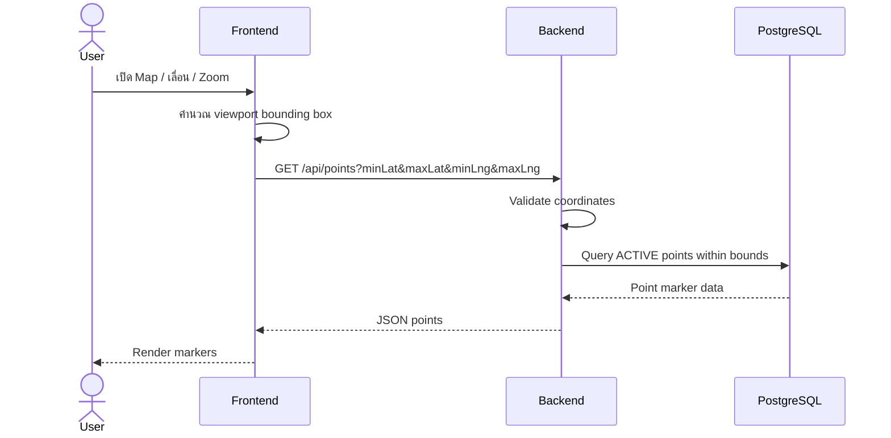
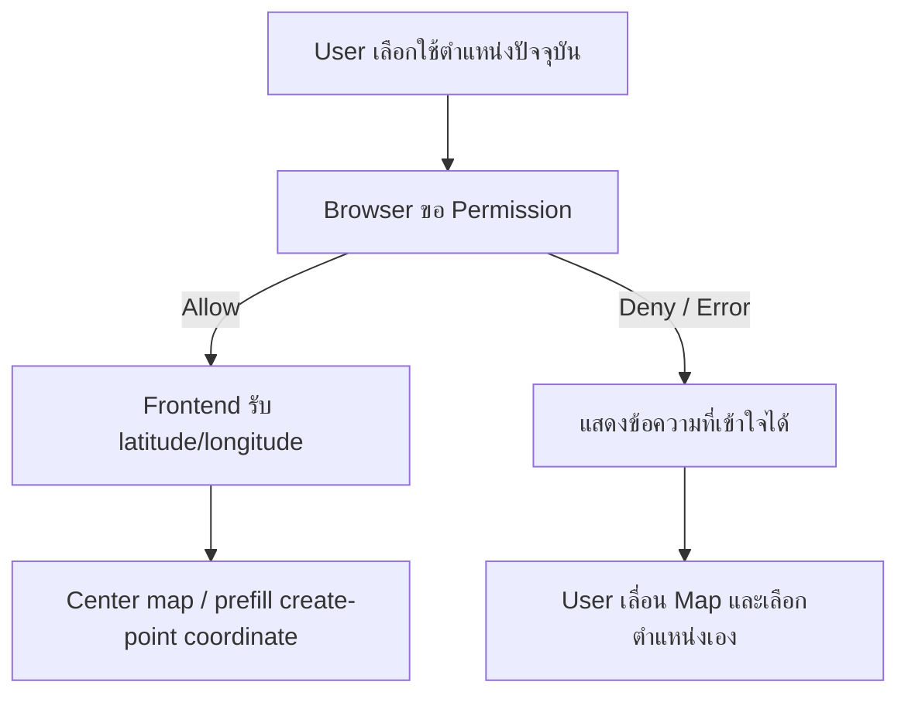
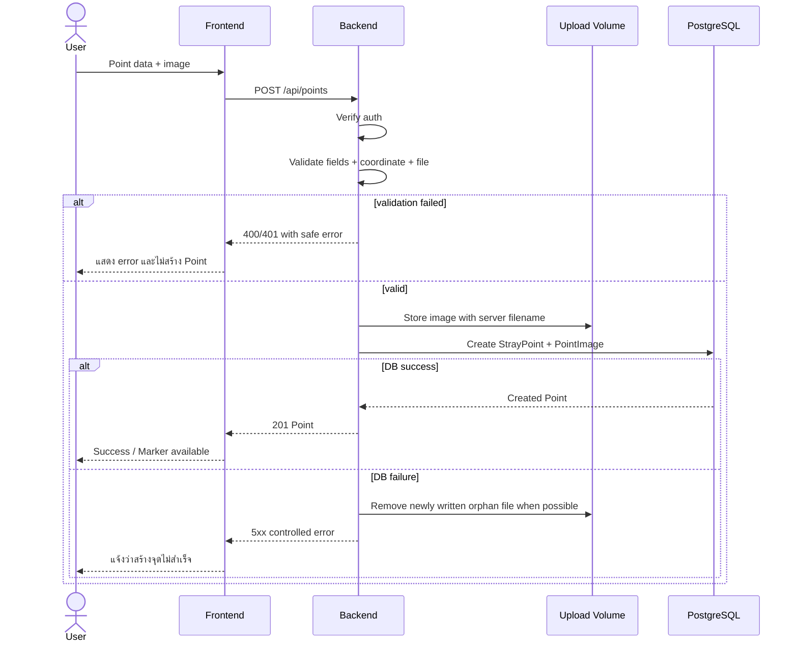
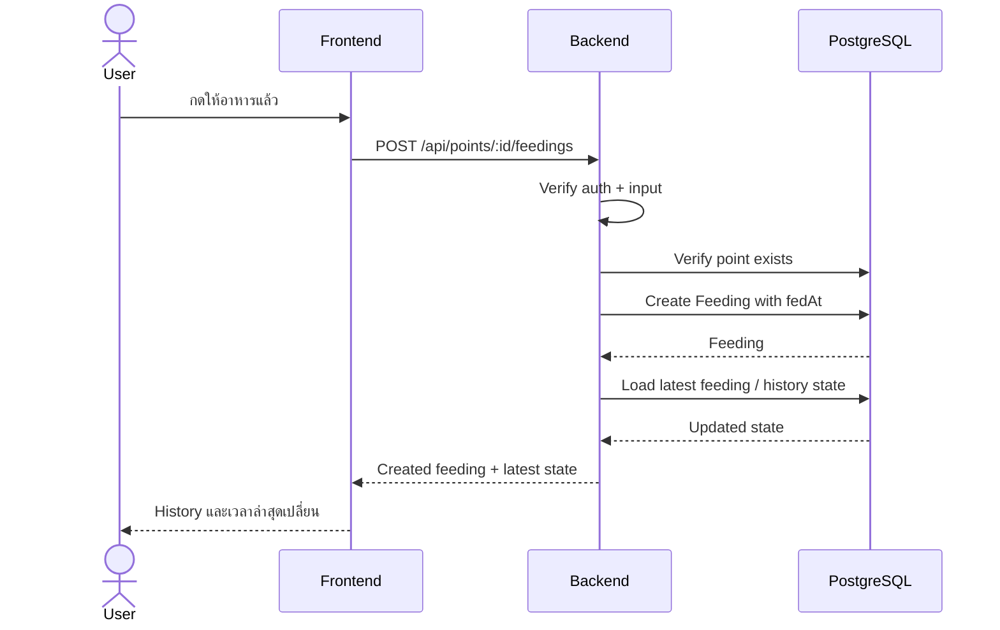

# PawFeed — Data Flow

## 1. Purpose

กำหนดเส้นทางข้อมูลสำคัญของ PawFeed เพื่อให้ Implementation, Test และ Demo อ้างอิง flow เดียวกัน

## 2. Authentication Flow



Security rule: UI และ API ไม่เปิดเผยว่า email หรือ password ช่องใดผิด

## 3. Load Map Flow



Map API ไม่ควรโหลดทุก Point ทั้งระบบเมื่อ viewport query พร้อมใช้งาน

## 4. Geolocation Flow



PawFeed อาจติดตาม current user location แบบ session-scoped ระหว่าง Navigation และส่งพิกัดชั่วคราวไป Backend เพื่อ route/reroute แต่ไม่ persist เป็น location history

## 5. Create Point Flow

Request: `multipart/form-data`



Consistency rule: หาก DB create ไม่สำเร็จหลังเขียนไฟล์ ระบบควร cleanup ไฟล์ใหม่เพื่อไม่ทิ้ง orphan โดยไม่จำเป็น

## 6. Point Detail Flow

```text
Frontend
→ GET /api/points/:id
→ Backend validates id
→ PostgreSQL loads Point + image + creator summary + latest reports/feedings
→ Backend returns normalized detail response
→ Frontend renders detail
```

กรณีไม่พบ Point: API ตอบ `404` และ UI แสดง Not Found state

## 7. Feeding Flow



`last feeding time` ต้อง derive จากข้อมูล Feeding จริง ไม่ใช้ค่าคงที่ใน UI

## 8. Point Report Flow

```text
Authenticated User
→ POST /api/points/:id/reports { type: STILL_HERE | NOT_FOUND }
→ Backend validates auth/type/point
→ Create PointReport
→ STILL_HERE: สามารถ update lastSeenAt ตาม business rule ที่ lock ใน implementation
→ Return updated reporting state
→ UI แสดงผลสำเร็จ
```

MVP ยังไม่รับปาก auto-inactivate Point จากจำนวน NOT_FOUND report

## 9. Navigation Flow

```text
User clicks Navigate
→ Frontend opens /points/:id/navigate inside PawFeed
→ Browser Geolocation or manual map pick provides origin
→ Frontend calls GET /api/navigation/route
→ Backend validates coordinates/mode
→ Backend calls configured OSRM-compatible provider
→ Backend normalizes road geometry + distance + duration + maneuver steps
→ Frontend renders Road Route Preview
→ User starts Active Navigation
→ GPS updates drive Follow/Recenter, remaining distance/ETA and next maneuver
→ accuracy-aware off-route detection may request a replacement route
→ reroute/GPS failures preserve navigation context and expose retry actions
```

Current user location is session/runtime navigation data only and is not persisted in PawFeed database.

## 10. Profile Flow

```text
Authenticated User
→ GET /api/auth/me
→ GET user's created points / feedings
→ Backend scopes query ด้วย authenticated user id
→ PostgreSQL returns only matching records
→ Frontend renders history
```

Authorization ต้อง enforce ที่ backend query ไม่ใช่ filter เฉพาะ frontend

## 11. Error Response Flow

Backend ใช้ response shape ที่ frontend แปลงเป็น UI state ได้ เช่น:

```json
{
  "success": false,
  "error": {
    "code": "INVALID_COORDINATE",
    "message": "ตำแหน่งไม่ถูกต้อง",
    "requestId": "..."
  }
}
```

ข้อกำหนด:
- ไม่ส่ง stack trace ให้ client
- ไม่ส่ง secret/internal database detail
- error code คงที่พอให้ automated test ตรวจได้
- human-readable message ต้องแสดงบน UI สำหรับ failure case สำคัญ

## 12. State Ownership

| State | Source of Truth |
|---|---|
| User account | PostgreSQL |
| Authentication validity | Backend-issued auth/session token rules |
| Stray Point | PostgreSQL |
| Point image metadata | PostgreSQL |
| Image bytes | Persistent upload volume |
| Feeding history | PostgreSQL |
| Point reports | PostgreSQL |
| Current browser location | Browser only; not persisted |
| Map tile/render state | Frontend / external OSM |
