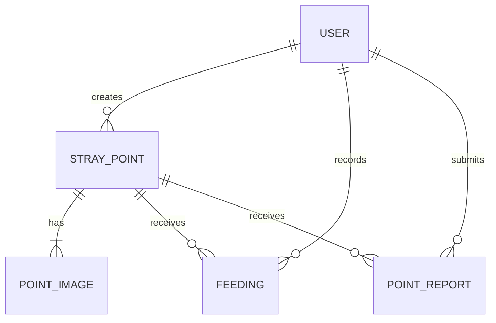

# PawFeed — Database Design

## 1. Database

PawFeed ใช้ PostgreSQL เป็น Source of Truth และใช้ Prisma เป็น ORM / migration layer

## 2. Entities

### User

| Field | Type | Rule |
|---|---|---|
| id | UUID/CUID | primary key |
| name | string | required |
| email | string | required, unique, normalized |
| passwordHash | string | required, never returned to client |
| createdAt | datetime | required |
| updatedAt | datetime | required |

### StrayPoint

| Field | Type | Rule |
|---|---|---|
| id | UUID/CUID | primary key |
| createdByUserId | relation | required → User |
| animalType | enum | DOG / CAT / OTHER |
| estimatedCount | integer | >= 1 |
| description | text | required |
| latitude | decimal/double | -90..90 |
| longitude | decimal/double | -180..180 |
| usualTime | string nullable | optional display value |
| status | enum | ACTIVE / INACTIVE |
| lastSeenAt | datetime nullable | latest confirmed seen time |
| createdAt | datetime | required |
| updatedAt | datetime | required |

Recommended indexes:
- `status`
- `(latitude, longitude)` baseline index strategy; implementation may use suitable indexes for bounding-box query
- `createdByUserId`
- `createdAt`

### PointImage

| Field | Type | Rule |
|---|---|---|
| id | UUID/CUID | primary key |
| pointId | relation | required → StrayPoint |
| imageUrl | string | server-controlled path/url |
| createdAt | datetime | required |

MVP requires at least one image when creating a Point.

### Feeding

| Field | Type | Rule |
|---|---|---|
| id | UUID/CUID | primary key |
| pointId | relation | required → StrayPoint |
| userId | relation | required → User |
| note | text nullable | optional |
| imageUrl | string nullable | optional capability; not mandatory v1 acceptance |
| fedAt | datetime | required; server timestamp baseline |
| createdAt | datetime | required |

Recommended indexes:
- `(pointId, fedAt DESC)`
- `(userId, fedAt DESC)`

Latest feeding is derived from the newest `Feeding.fedAt` for a Point; it is not a hard-coded UI value.

### PointReport

| Field | Type | Rule |
|---|---|---|
| id | UUID/CUID | primary key |
| pointId | relation | required → StrayPoint |
| userId | relation | required → User |
| type | enum | STILL_HERE / NOT_FOUND |
| createdAt | datetime | required |

Recommended indexes:
- `(pointId, createdAt DESC)`
- `userId`

## 3. Relationships



## 4. Referential Behavior

Baseline rules:
- ห้ามสร้าง StrayPoint ด้วย `createdByUserId` ที่ไม่มีจริง
- ห้ามสร้าง Feeding/PointReport กับ Point/User ที่ไม่มีจริง
- ไม่มี hard-delete user/point requirement ใน MVP; หลีกเลี่ยง cascade delete ที่ทำลาย evidence/history โดยไม่จำเป็น
- Point status ใช้ `ACTIVE/INACTIVE` เพื่อควบคุม visibility แทนการลบข้อมูลหลัก

## 5. Transaction Boundaries

### Create Point
ควรให้การสร้าง `StrayPoint` และ `PointImage` metadata อยู่ใน database transaction เดียวกัน

ไฟล์อยู่ filesystem จึงไม่สามารถอยู่ใน PostgreSQL transaction เดียวกันได้; flow ต้องมี compensating cleanup หาก DB transaction fail หลังไฟล์ถูกเขียน

### Create Feeding
สร้าง Feeding เป็น atomic DB operation และ response ต้องอ่าน latest state จากข้อมูลจริงหลังสร้าง

### Point Report
สร้าง report และ update `lastSeenAt` (เฉพาะ rule ที่เกี่ยวข้อง) ควรทำใน transaction เดียวเมื่อ implementation ต้องแก้ทั้งสอง record/state

## 6. Coordinate Validation

Backend validation ก่อน DB write:
- latitude เป็น number และ `-90 <= latitude <= 90`
- longitude เป็น number และ `-180 <= longitude <= 180`
- reject NaN / empty / malformed values

Database schema อาจเพิ่ม CHECK constraint เป็น defense-in-depth หาก Prisma migration รองรับรูปแบบที่เลือก

## 7. Time Handling

- เก็บ timestamps เป็น UTC ใน database
- API ส่ง ISO 8601
- Frontend แสดงเวลาตาม locale/timezone ของผู้ใช้; Demo baseline คือ Asia/Bangkok
- Relative text เช่น “3 ชั่วโมงก่อน” คำนวณจาก timestamp จริง

## 8. Email Rules

- normalize email ก่อน comparison/storage ตาม implementation rule ที่กำหนด
- unique constraint ที่ database เป็น final guard against duplicate account
- duplicate register ต้องถูกแปลงเป็น controlled API error ไม่ expose raw DB error

## 9. Migration Strategy

Prisma migrations ต้องอยู่ใน repository:

```text
backend/prisma/schema.prisma
backend/prisma/migrations/
```

Pipeline/deployment ต้องมีขั้นตอน apply migration ที่ทำซ้ำได้

ห้ามใช้ database schema ที่ตั้งด้วยมือบนเครื่องสมาชิกเป็น prerequisite ของรุ่นส่ง

## 10. Persistence

PostgreSQL data directory mount กับ named volume `postgres-data`

Acceptance verification ใน Phase 6–8 ต้องพิสูจน์อย่างน้อย:
1. สร้าง user/point/feeding
2. restart/recreate application containers โดยไม่ลบ named volume
3. data ยัง query ได้

การใช้ `docker compose down -v` ถือเป็น explicit destructive cleanup และไม่ใช่ persistence test

## 11. Seed/Test Data

ถ้ามี seed:
- แยก test/demo seed ออกจาก production-like runtime
- ไม่เก็บ real personal data
- password ของ demo account ต้องเป็นข้อมูลทดสอบเท่านั้น
- automated tests ต้องสร้าง/cleanup state ที่คาดเดาได้
