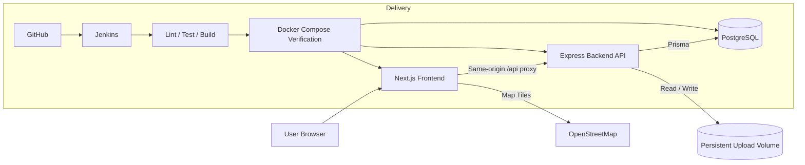
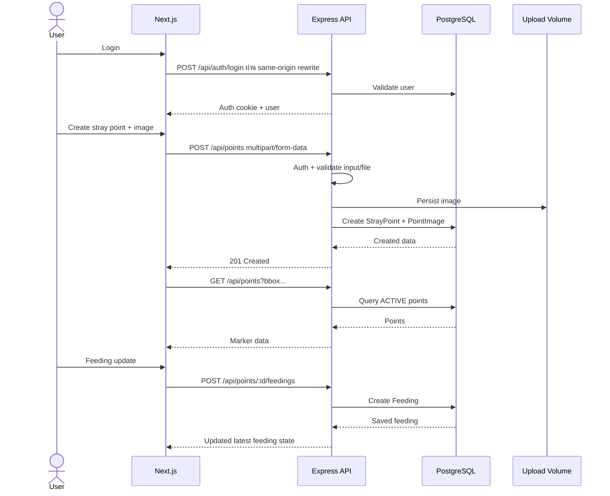

# PawFeed — System Design

## 1. Objective

เอกสารนี้กำหนด System Design สำหรับ PawFeed MVP โดยยึด Requirement Baseline ใน `docs/requirements/requirements.md` และ Acceptance Criteria ใน `docs/requirements/acceptance-criteria.md`

เป้าหมายคือให้ระบบทำงานจริงแบบ End-to-End, ตรวจสอบได้, ทำซ้ำได้ด้วย Docker Compose และสามารถนำไปทดสอบใน Course Container `tuchsanai/devtools:2569_1` ได้

## 2. Architecture Overview



## 3. Main Components

### 3.1 Frontend

Technology: Next.js + React

Responsibilities:
- แสดง Map / Marker / Point Detail
- Register / Login / Logout UI
- Add Stray Point form
- Upload image ผ่าน Backend
- Feeding Update
- Profile / personal history
- แสดง Validation และ Failure State ต่อผู้ใช้
- ขอ Geolocation Permission เฉพาะเมื่อผู้ใช้เลือกใช้ตำแหน่งปัจจุบัน
- Navigation Mode ภายในเว็บ แสดงจุดหมาย ตำแหน่งผู้ใช้ และระยะตรงโดยประมาณ

Frontend ไม่ถือ Business Rule สำคัญเป็น Source of Truth การตรวจ Auth, Validation และสิทธิ์ต้องเกิดที่ Backend ด้วยเสมอ

### 3.2 Backend

Technology: Node.js 22 + Express

Responsibilities:
- REST API
- Authentication / Authorization
- Input validation
- Business rules ของ Point, Feeding และ Point Report
- Coordinate validation
- File validation และ filename generation
- Query points ตาม bounding box
- Generate response ที่ frontend แสดง Error ได้อย่างเข้าใจได้
- Health endpoint

### 3.3 Database

Technology: PostgreSQL ผ่าน Prisma

เป็น Source of Truth ของ:
- User
- StrayPoint
- PointImage
- Feeding
- PointReport

Database data ต้อง Persist แยกจาก container lifecycle ผ่าน Docker Volume

### 3.4 Image Storage

MVP ใช้ local filesystem ที่ mount ผ่าน Docker named volume

Backend เป็น service เดียวที่เขียนไฟล์ upload

ข้อกำหนด:
- รับเฉพาะชนิดไฟล์รูปที่ allowlist
- จำกัดขนาด
- Generate unique filename ฝั่ง server
- ไม่เชื่อ original filename จาก client
- Path ใน database อ้างถึงไฟล์ที่ persistent storage

### 3.5 Map Integration

Map UI ใช้ Leaflet และ OpenStreetMap

ระบบต้องยังแสดงหน้าและข้อมูล Point ได้อย่างเหมาะสมหาก Browser ไม่อนุญาต Geolocation ผู้ใช้สามารถเลื่อนแผนที่เองได้

### 3.6 In-Web Navigation

PawFeed เปิด Navigation Mode ภายในเว็บที่ `/points/:id/navigate` และใช้ Leaflet/OpenStreetMap ชุดเดียวกับหน้า Map

เมื่อผู้ใช้อนุญาต Browser Geolocation หน้า Navigation จะติดตามตำแหน่งปัจจุบันระหว่างเปิดหน้า คำนวณระยะตรงโดยประมาณด้วยพิกัดบน client และแสดงเส้นตรงเชื่อมไปยังจุดหมาย

MVP ไม่คำนวณ road route หรือ turn-by-turn directions และไม่ส่งผู้ใช้ไป Google Maps โดยอัตโนมัติ ข้อมูลตำแหน่งผู้ใช้ยังคงอยู่ฝั่ง browser และไม่ถูก persist ลงฐานข้อมูล

## 4. Runtime Containers

Target runtime สำหรับ MVP:

```text
pawfeed-frontend
pawfeed-backend
pawfeed-postgres
```

Logical network:

```text
pawfeed-network
```

Persistent volumes:

```text
postgres-data
pawfeed-uploads
```

Browser เรียก API/Upload แบบ same-origin ผ่าน Next.js (`/api/*`, `/uploads/*`) และ Frontend container rewrite ไป `http://backend:3001` ภายใน Docker network จึงไม่ hard-code host ของเครื่องสมาชิกใน Browser

Backend ติดต่อ PostgreSQL ผ่าน `DATABASE_URL`

## 5. Port Strategy

ค่า development baseline:

| Component | Internal | Host |
|---|---:|---:|
| Frontend | 3000 | 3000 |
| Backend | 3001 | 3001 |
| PostgreSQL | 5432 | ไม่จำเป็นต้อง expose ใน production-like compose |

Port ต้อง override ได้ผ่าน environment/configuration หาก Course Container มี conflict

## 6. Authentication Boundary

Guest:
- ดู Map
- ดู Point Detail
- เปิด Navigation

Authenticated User:
- สร้าง Point
- บันทึก Feeding
- ส่ง STILL_HERE / NOT_FOUND
- ดู Profile / History

Backend ต้อง Reject write action ที่ไม่มี valid authentication แม้ frontend จะซ่อนปุ่มแล้วก็ตาม

## 7. Core End-to-End Flow



## 8. Health and Operability

Backend ต้องมี health endpoint อย่างน้อย:

```text
GET /health/live
GET /health/ready
```

แนวคิด:
- `live`: process ยังตอบสนอง
- `ready`: dependency สำคัญ เช่น database ใช้งานได้

Docker/Jenkins จะใช้ readiness/smoke verification ใน Phase 6–7

Logging baseline:
- HTTP method
- path
- status
- request identifier
- server-side error category

ห้าม log password, JWT, cookie หรือข้อมูลลับ

## 9. Engineering Decisions

### ไม่ใช้ Redis
MVP ไม่มี shared cache/session requirement ที่จำเป็นต่อ Acceptance Criteria

### ไม่ใช้ Message Broker
ไม่มี background job critical path ใน MVP

### ไม่ใช้ Traefik
สาม service หลักสามารถเชื่อมต่อผ่าน Docker Compose ได้โดยตรง และลดจุดล้มเหลวในการ Demo

### ไม่ใช้ AI/LLM Runtime Feature
ไม่เกี่ยวข้องกับ Core Problem และจะเพิ่ม Requirement, Privacy Risk และ Failure Mode โดยไม่จำเป็น

## 10. Reproducibility Principle

ระบบรุ่นส่งต้องไม่พึ่ง:
- local database ของสมาชิก
- global npm package ที่ไม่ได้ประกาศ
- secret ที่ commit ใน repo
- upload file ที่อยู่นอก persistent volume
- manual setup ที่ไม่มีใน README/script

Target flow:

```text
git clone
→ copy .env.example to .env / provide environment
→ docker compose up -d --build
→ health check
→ automated verification
→ docker compose down
```

## 11. Traceability

System Design นี้รองรับกลุ่ม Requirement หลัก:
- REQ-AUTH-*
- REQ-MAP-*
- REQ-POINT-*
- REQ-IMG-*
- REQ-FEED-*
- REQ-REPORT-*
- REQ-NAV-*
- REQ-NFR-*

รายละเอียดความสัมพันธ์ราย Requirement ดู `docs/requirements/traceability-matrix.md`
