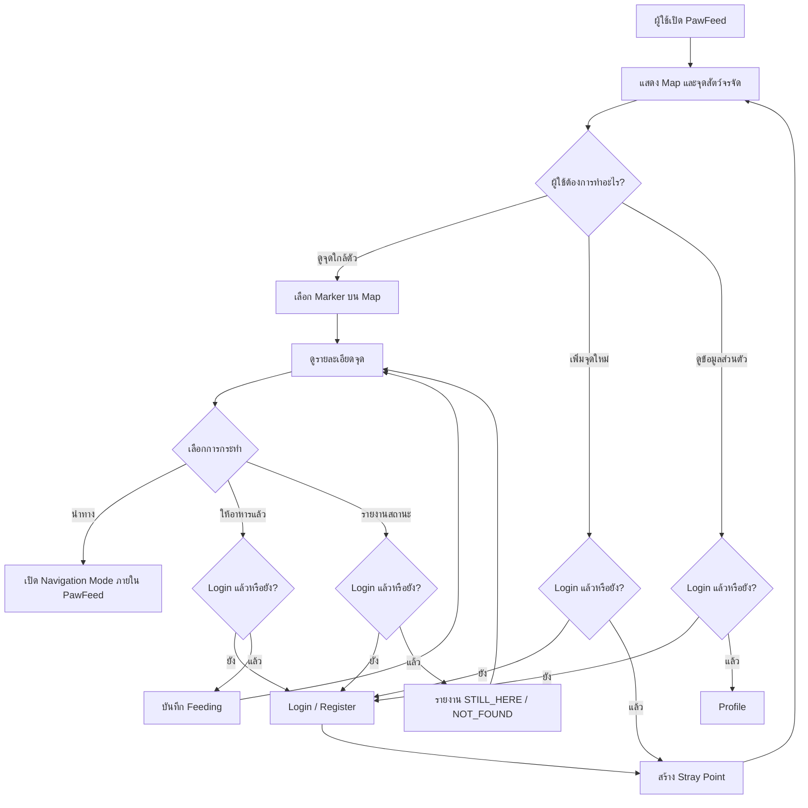
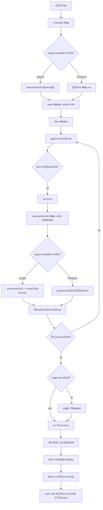
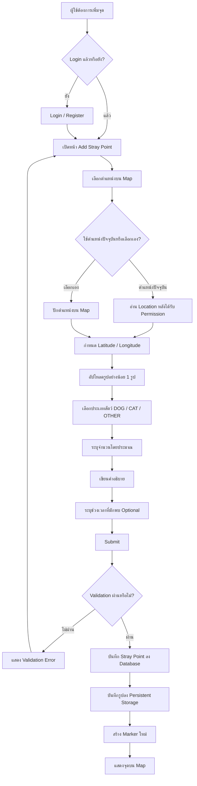
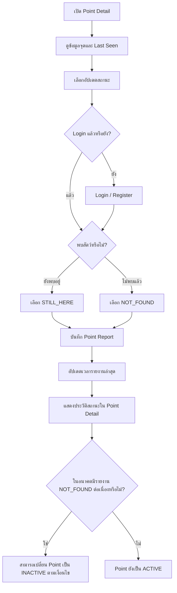
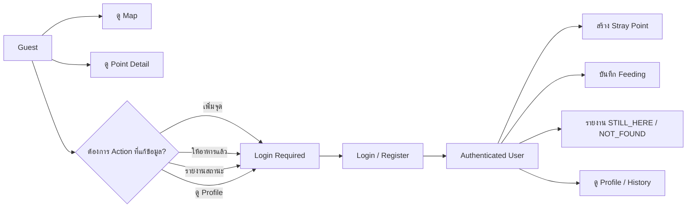
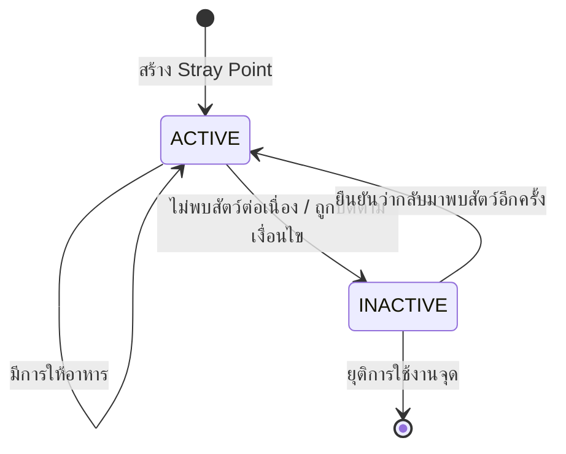
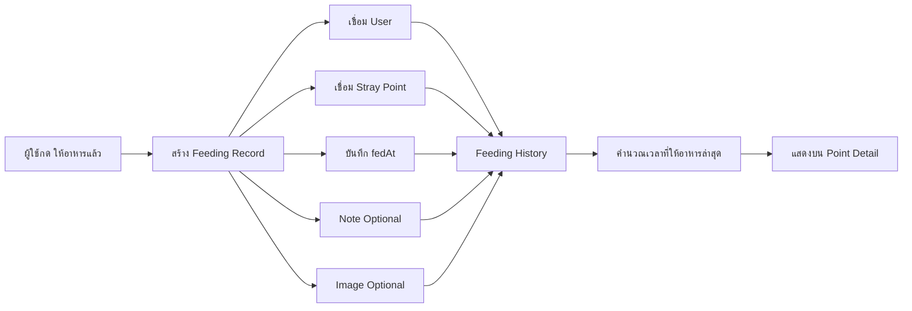
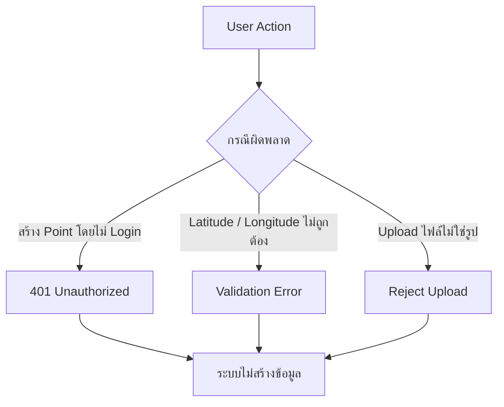

# PawFeed — User Flow

เอกสารนี้สรุป User Flow จาก `docs/spec.md` ให้อ่านง่ายในรูปแบบ Mermaid Diagram

---

## 1. Overall User Flow



---

## 2. Flow — ค้นหาจุดและไปให้อาหาร



---

## 3. Flow — เพิ่มจุดสัตว์จรจัดใหม่



---

## 4. Flow — รายงานว่าสัตว์ยังอยู่หรือไม่



---

## 5. Flow — Authentication Gate



---

## 6. Flow — Point Lifecycle



---

## 7. Flow — Feeding Data Update



---

## 8. Demo Flow

Flow นี้เหมาะสำหรับใช้ Demo โปรเจกต์แบบ End-to-End

```mermaid
flowchart LR
    A[เปิด Map] --> B[Login]
    B --> C[เพิ่ม Stray Point]
    C --> D[Upload รูป]
    D --> E[ปัก Location]
    E --> F[Submit]
    F --> G[Marker ปรากฏบน Map]
    G --> H[เปิด Point Detail]
    H --> I[กด Navigate]
    I --> J[กลับมาบันทึก ให้อาหารแล้ว]
    J --> K[Feeding History อัปเดต]
    K --> L[Restart Containers]
    L --> M[ตรวจว่าข้อมูลและรูปยัง Persist]
```



---

## 9. Failure Flow สำหรับ Demo



---

## 10. User Flow แบบสั้นที่สุด

```text
Guest
  ↓
เปิด Map
  ↓
ดู Marker
  ↓
เปิด Point Detail
  ↓
กด Navigate
  ↓
เดินทางไปให้อาหาร
  ↓
Login
  ↓
กด "ให้อาหารแล้ว"
  ↓
Feeding History อัปเดต

หรือ

Login
  ↓
เพิ่ม Stray Point
  ↓
ปัก Location + Upload รูป + ใส่รายละเอียด
  ↓
Submit
  ↓
Marker ใหม่ขึ้นบน Map
  ↓
ผู้ใช้อื่นค้นพบและเดินทางไปช่วยได้
```
